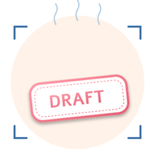

<div align="center">



# image_lib

**Lightweight image processing for Bun & Node  dynamic text stamps + color-based transparent cropping, powered by [@napi-rs/canvas](https://github.com/Brooooooklyn/canvas).**

[](https://bun.com)
[](https://www.typescriptlang.org)
[](#testing)
[](#license)

[English](./README.md)  [简体中文](./README.zh-CN.md)

</div>

---

##  Features

-  **Color-based cropping**  Locate a bounding box by target color (default yellow), keep **inside** *or* **outside** the box, with optional white-background transparency.
-  **Region-aware stamp**  `cropTransparentBackground` returns the punched region, which feeds straight into `generateDynamicStamp` so text lands exactly inside the "hole".
-  **Auto font-size**  When `textRegion` is provided, font size defaults to `region.height - margins` so glyphs fill the punched area without manual tuning.
-  **Screen-snow speckle texture**  Tiny **irregular polygons** (4-7 vertex jagged shapes, like TV static) are punched **transparent** into the text by default for an authentic worn-ink look. Coverage target 0.5-1% of text area. Seedable, mode-switchable (`uniform` / `per-char` / `none`), color overridable (`'#FFFFFF'` for opaque white speckles, `'#000000'` for black ink etc.).
-  **Smart text fitting**  Long text either **stretches** the canvas horizontally (default) or stays put with `shrink` / `clip` / `overflow` strategies.
-  **3-tier font loading**  Remote URL (cached)  local file  system font family fallback. CJK + Latin out of the box.
-  **Security-first font cache**  Whitelisted sandbox + blacklist for system directories; cross-platform safe filename normalization.
-  **Zero-bloat CLI**  Single `image-lib` binary with `stamp`, `crop`, and `gen` (one-shot crop+stamp pipeline) subcommands. No `commander`, no `yargs`.
-  **5 encode formats**  `png` / `jpeg` / `webp` / `avif` / `gif` with proper quality/AvifConfig dispatch.
-  **Dual build pipeline**  `build:js` (Bun bundler  `dist/main.js` ESM) + `build:types` (`tsc`  `dist/*.d.ts` declarations) so consumers get full IntelliSense.

---

##  Installation

```bash
# With Bun (recommended)
bun add npm:@vdhewei/image-lib

# With pnpm / npm / yarn
pnpm add @vdhewei/image-lib
npm  install @vdhewei/image-lib
yarn add @vdhewei/image-lib
```

> Requires **Bun  1.0** or **Node  18** (with `@napi-rs/canvas` prebuilt binaries).

---

##  Quick Start

```ts
import {
  cropTransparentBackground,
  generateDynamicStamp,
} from "image_lib";
import { writeFileSync } from "fs";

// 1. Crop: locate the yellow box and punch it out, also remove white background
const { buffer, region } = await cropTransparentBackground({
  sourceImgPath: "images/draft.png",
  outputPath:    "out/clean-bg.png",
  // keepRegion: "outside" (default)  keep area outside the yellow box
  // transparentColor defaults to white {r:255,g:255,b:255}
});

console.log(`Punched region: ${region.width}x${region.height} at (${region.x},${region.y})`);

// 2. Stamp: render text precisely inside the punched region
const stamp = await generateDynamicStamp({
  backgroundPath: "out/clean-bg.png",
  text:           "CONFIDENTIAL",
  textRegion:     region,           //  perfect alignment, zero math
  // fontSize auto-defaults to region.height - margins
  // speckleMode defaults to 'per-char' + speckleColor 'transparent'
  //   irregular polygon "screen-snow" punched into the text, 0.5-1% coverage
  // stretchTextRegion: true (default)  long text widens the canvas
  fontColor:      "#FF99A8",
});
writeFileSync("out/final-stamp.png", stamp);
```

> **CLI one-liner equivalent:** `image-lib gen --src images/draft.png --text "CONFIDENTIAL" --out out/final-stamp.png`  the `gen` subcommand wraps the two-step library call into a single pipeline (crop  stamp) with automatic region forwarding.

---

##  CLI

```bash
# After install
image-lib --help
image-lib stamp --help
image-lib crop  --help

# Or via Bun directly (from source)
bun run src/bin.ts <command> ...
```

### `crop`  color-based cropping

```bash
# Default: keep outside the yellow box, remove white background  outputs source-sized PNG
image-lib crop --src images/draft.png --out out/clean.png

# Output includes the region coordinates, ready to paste into `stamp --text-region`:
#   region: x=25 y=175 w=248 h=73
#   Use as stamp --text-region: "25,175,248,73"

# Keep inside the box, cropped to box size
image-lib crop --src images/draft.png --out out/inside.png --keep inside

# Disable white-background transparency, preserve all original colors
image-lib crop --src images/draft.png --out out/no-trans.png --no-transparent
```

| Flag | Default | Description |
|---|---|---|
| `--src`, `--source <path>` |  | **Required.** Source image path |
| `--out`, `--output <path>` | `out/clean-bg.<ext>` | Output path (PNG recommended) |
| `--keep <outside\|inside>` | `outside` | Which side of the bounding box to keep |
| `--target-color <r,g,b>` | `255,215,0` | Color used to locate the bounding box |
| `--target-tolerance <n>` | `80` | Euclidean color distance tolerance |
| `--transparent-color <r,g,b>` | `255,255,255` | Color to make transparent (within kept area) |
| `--transparent-tolerance <n>` | `40` | Tolerance for transparent color |
| `--no-transparent` | off | Disable color-based transparency |
| `--padding <px>` | `0` | `outside`: shrink hole inward  `inside`: expand crop outward |
| `--format <fmt>` | `png` | `png` / `jpeg` / `webp` / `avif` / `gif` |
| `--quality <0-100>` |  | JPEG/WebP/GIF quality |

### `stamp`  dynamic text stamp

```bash
# Auto-width canvas (no textRegion)  original three-segment stretch behavior
image-lib stamp --bg images/draft.png --text "草稿" --out out/zh.png

# Region-aware: text precisely fills the punched area
# (font size auto-follows region.height, transparent screen-snow speckles on by default)
image-lib stamp --bg out/clean.png --text "DRAFT v1.0" \
  --text-region "25,175,248,73" --out out/exact.png

# Long text  default stretches the canvas wider
image-lib stamp --bg out/clean.png --text "This is a very long draft text" \
  --text-region "25,175,248,73" --out out/stretched.png

# Long text without stretching  font size auto-shrinks
image-lib stamp --bg out/clean.png --text "This is a very long draft text" \
  --text-region "25,175,248,73" --no-stretch --overflow shrink --out out/shrunk.png

# Disable speckle effect (clean glyphs)
image-lib stamp --bg out/clean.png --text "CLEAN" \
  --text-region "25,175,248,73" --no-speckle --out out/clean-text.png

# Opaque white speckles instead of transparent (rubber-stamp look)
image-lib stamp --bg out/clean.png --text "DRAFT" \
  --text-region "25,175,248,73" --speckle-color "#FFFFFF" --out out/white-speckle.png

# Reproducible speckle (CI / golden-file tests)
image-lib stamp --bg out/clean.png --text "DRAFT" \
  --text-region "25,175,248,73" --speckle-seed 42 --out out/reproducible.png
```

| Flag | Default | Description |
|---|---|---|
| `--bg`, `--background <path>` |  | **Required.** Background image |
| `--text <string>` |  | **Required.** Stamp text (1255 chars) |
| `--out`, `--output <path>` | `out/stamp.<ext>` | Output path |
| `--text-region <x,y,w,h>` |  | Region where text is rendered (in pixels) |
| `--no-stretch` | off | Keep canvas size when text overflows region |
| `--overflow <strategy>` | `shrink` | `shrink` / `clip` / `overflow` (only when `--no-stretch`) |
| `--font-url <url>` |  | Remote font URL (highest priority, auto-cached) |
| `--font-file <path>` |  | Local font file path (`.ttf` / `.otf` / `.woff` / `.woff2`) |
| `--font-family <css>` | system fallback | CSS font-family string |
| `--font-name <name>` | `StampFont` | Name registered to `GlobalFonts` |
| `--font-size <size>` | `region.height - margins` *(auto)* or `40` if no region | Glyph size. Accepts raw px (`32`), `32px`, or `24pt` (pt → px at 96 DPI: `×4/3`) |
| `--font-color <#hex>` | `#FF99A8` | |
| `--no-bold` | off | Disable bold |
| `--margin <n>` | `20` | Uniform 4-side margin (or `--margin-top/right/bottom/left`) |
| `--speckle-mode <m>` | `per-char` | `none` / `uniform` / `per-char` (screen-snow noise pattern) |
| `--speckle-density <0-1>` | `0.0075` | **Target** punched-area coverage on text (recommended 0.0050.01) |
| `--speckle-size <px>` | `1.2` | Polygon base radius (0  20); actual shapes are 4-7 vertex irregular polygons |
| `--speckle-color <css>` | `transparent` | Speckle color. Default punches holes via `destination-out`. Use `#FFFFFF` / `#000000` for opaque speckles |
| `--speckle-seed <int>` | random | PRNG seed for reproducible noise (golden tests) |
| `--no-speckle` | off | Shortcut for `--speckle-mode none` |
| `--format <fmt>` | `png` | `png` / `jpeg` / `webp` / `avif` / `gif` |
| `--quality <0-100>` |  | JPEG/WebP/GIF quality |

### `gen`  one-shot crop + stamp pipeline

Combines `crop` and `stamp` into a single call. Detects the yellow box in `--src`, punches it transparent, then renders `--text` precisely inside the resulting region. No need to manually pass `--text-region`  the region is auto-derived from the crop output.

**`gen`-only font defaults** (the underlying library would otherwise auto-infer from region height): when neither `--font-family` / `--font-url` / `--font-file` / `--font-name` is given, `gen` uses `sans-serif`; when `--font-size` is omitted, `gen` uses `24pt` (= `32px` at 96 DPI). Any explicit flag overrides these.

```bash
# Simplest: detect yellow box, write "Approved" inside  uses sans-serif + 24pt(32px)
image-lib gen --src images/draft.png --text "Approved" --out out/approved.png

# Keep the intermediate crop on disk for inspection
image-lib gen --src images/draft.png --text "草稿" \
  --out out/zh.png --intermediate out/zh-crop.png

# Custom font family + pt size unit (auto-converted: 30pt  40px)
image-lib gen --src images/draft.png --text "Confidential" --out out/cf.png \
  --font-family 'Georgia, "Times New Roman", serif' --font-size 30pt

# Different output format + disable speckle
image-lib gen --src images/draft.png --text "DRAFT" --out out/draft.jpg \
  --format jpeg --quality 90 --font-color "#FF0000" --no-speckle

# All `crop` and `stamp` flags pass through, e.g. custom target color or font
image-lib gen --src images/draft.png --text "DONE" --out out/done.png \
  --target-color "0,128,255" --speckle-seed 42
```

| Flag | Default | Description |
|---|---|---|
| `--src`, `--source <path>` |  | **Required.** Source image path |
| `--text <string>` |  | **Required.** Stamp text (1255 chars) |
| `--out`, `--output <path>` | `out/gen-stamp.<ext>` | Final stamp output path |
| `--intermediate <path>` |  | Save the cropped intermediate to this path (kept). When omitted, a temp file in the OS tmp dir is used and deleted after rendering. |
| `--keep-intermediate` | off | When `--intermediate` is omitted, auto-name the crop in `out/gen-crop-<ts>.png` and keep it |
| **Crop flags** |  | `--keep` / `--target-color` / `--target-tolerance` / `--transparent-color` / `--transparent-tolerance` / `--no-transparent` / `--padding` |
| `--font-family <css>` | **`sans-serif`** *(gen-only)* | Skipped if `--font-url` / `--font-file` / `--font-name` is set |
| `--font-size <size>` | **`24pt` = `32px`** *(gen-only)* | Accepts raw px (`32`), `32px`, or `24pt`. When given, overrides region-height inference |
| **Other font flags** |  | `--font-url` / `--font-file` / `--font-name` / `--font-color` / `--no-bold` (same as `stamp`) |
| **Other stamp flags** |  | All `--margin-*` / `--speckle-*` / `--no-speckle` / `--no-stretch` / `--overflow` are forwarded. **`--text-region` is ignored**  the region comes from crop output. |
| `--format <fmt>` | `png` | `png` / `jpeg` / `webp` / `avif` / `gif` (applies to final output; intermediate is always PNG to preserve transparency) |
| `--quality <0-100>` |  | JPEG/WebP/GIF quality (final output only) |

---

##  Library API

### `cropTransparentBackground(options): Promise<CropResult>`

Color-based cropping with two retention modes.

```ts
interface CropOptions {
  sourceImgPath: string;                  // required
  outputPath?: string;                    // also writes to disk if provided
  keepRegion?: "outside" | "inside";      // default: "outside"
  targetColor?: RGB;                      // default: yellow {r:255,g:215,b:0}
  targetTolerance?: number;               // default: 80
  transparentColor?: RGB | null;          // default: white. Pass null to disable.
  transparentTolerance?: number;          // default: 40
  padding?: number;                       // default: 0
  encodeOptions?: EncodeFormat | EncodeOptions;
}

interface CropResult {
  buffer: Buffer;                         // encoded image
  region: { x: number; y: number; width: number; height: number };
  width:  number;                         // output canvas width
  height: number;                         // output canvas height
}
```

| Mode | Output size | `region` describes | `padding` semantics |
|---|---|---|---|
| `outside` (default) | source dimensions | The transparent "hole" in the canvas | shrinks the hole **inward** (preserves the colored border) |
| `inside` | bounding box dimensions | Always `{x:0, y:0, w:canvasW, h:canvasH}` | expands the crop **outward** |

### `generateDynamicStamp(options): Promise<Buffer>`

```ts
interface GenerateStampOptions {
  backgroundPath: string;                 // required
  text: string;                           // required (1255 chars)
  fontSize?: number;                      // default: auto (region.height - margins) | 40 if no region
  fontColor?: string;                     // default: '#FF99A8'
  fontBold?: boolean;                     // default: true
  fontFamily?: string;                    // CSS font-family
  fontURL?: string;                       // remote URL (auto-cached)
  fontFilePath?: string;                  // local .ttf/.otf/.woff/.woff2
  fontName?: string;                      // registered to GlobalFonts
  margin?: { top: number; right: number; bottom: number; left: number };
  encodeOptions?: EncodeFormat | EncodeOptions;

  //  Region mode 
  textRegion?: { x: number; y: number; width: number; height: number };
  stretchTextRegion?: boolean;            // default: true (when textRegion is set)
  overflowStrategy?: "shrink" | "clip" | "overflow";  // default: "shrink"

  //  Rubber-stamp speckle effect 
  speckleMode?: SpeckleMode;              // default: 'per-char' ('none' | 'uniform' | 'per-char')
  speckleDensity?: number;                // default: 0.0075  TARGET punched coverage on text (0-1, recommended 0.005-0.01)
  speckleSize?: number;                   // default: 1.2px polygon base radius (0-20); algorithm reverse-derives dot count
  speckleColor?: string;                  // default: 'transparent' (destination-out punch); pass '#FFFFFF' / '#000000' for opaque speckle
  speckleSeed?: number;                   // PRNG seed for reproducible output (mulberry32)
}

type SpeckleMode = 'none' | 'uniform' | 'per-char';
```

**Speckle algorithm (screen-snow polygons + target-coverage reverse derivation):**

`density` is the **target** ratio of text pixels that get "punched" or color-covered  not a per-pixel probability. The algorithm:

1. Scans `textRegion` and collects pixels that match `fontColor` (with tolerance)
2. Computes target dot count: `N = round(candidates × density / (π × size² × antialias_compensation))` with `compensation = 0.12`
3. Samples `N` positions via `uniform` (global probability) or `per-char` (x-binned with ±35% jitter)
4. At each position draws an **irregular polygon** with 4-7 vertices at random angles & radii (0.3-1.3 × size) for screen-snow / TV-static look
5. If `speckleColor === 'transparent'` (default): uses `globalCompositeOperation = 'destination-out'` to punch holes in the text revealing background. Otherwise fills with the given color via `source-over`.

This means **changing `speckleSize` does not affect coverage**  bigger polygons  fewer polygons, total punched area stays at `density × text_area`. Real-world measured coverage (default settings, seed=100): **0.45%-1.11%** across 6 English samples (avg 0.80%, target 0.75%).

**Two rendering modes:**

| Condition | Behavior |
|---|---|
| No `textRegion` | Original three-segment stretch  canvas auto-widens to fit text, background stretches horizontally with fixed 15% left/right edges. |
| `textRegion` set, text fits | Canvas keeps background dimensions, text centered inside the region. |
| `textRegion` set, text overflows, `stretchTextRegion: true` *(default)* | Canvas widens horizontally to fit, region stretches, left/right background preserved. |
| `textRegion` set, text overflows, `stretchTextRegion: false` | Apply `overflowStrategy`:<br> `shrink`  binary-search font size down<br> `clip`  render full size, clip to region<br> `overflow`  render full size, allow overflow |

### English stamp samples

These six samples are produced both as test fixtures (`tests/data/en-*.png`) and via the CLI for manual review (`out/en-*.png`). All sit within (or close to) the 0.5-1% punched-area target:

```bash
# Reproduces all 6 with seed=100; coverage = (pink_pixels_baseline - pink_pixels_actual) / pink_pixels_baseline
for t in COMP Draft Pending Reject Approved "PEND."; do
  image-lib stamp --bg out/clean.png --text "$t" \
    --text-region "25,175,248,73" --speckle-seed 100 \
    --out "out/en-${t//./_}.png"
done
```

| Sample | Baseline pink | After speckle | Punched | Coverage |
|---|---:|---:|---:|---:|
| `COMP`     | 1 360 | 1 352 |  8 | **0.59 %** |
| `Draft`    | 1 007 |   996 | 11 | **1.09 %** |
| `Pending`  | 1 634 | 1 621 | 13 | **0.80 %** |
| `Reject`   | 1 290 | 1 280 | 10 | **0.78 %** |
| `Approved` | 1 808 | 1 788 | 20 | **1.11 %** |
| `PEND.`    | 1 330 | 1 324 |  6 | **0.45 %** |

> Average: **0.80%**, target: 0.75%. Spread (0.45%-1.11%) is dominated by sampling variance — with only 5-20 polygons per sample, ±50% variance per measurement is normal. Wider text (Approved, Draft) gives more dots but with thin-stroke letters those dots fall on stroke edges, increasing effective punch ratio.

### Font loading (3-tier fallback)

`loadFont(options)` tries each source in order, returning the resolved font-family string:

1. **`fontURL`**  Download to `font_cache/`, register to `GlobalFonts`. Re-runs are cache-hits.
2. **`fontFilePath`**  `GlobalFonts.registerFromPath`, no download.
3. **`fontFamily`**  Pass-through CSS string, relies on system fonts.

```ts
// Recommended: jsDelivr mirror of @fontsource (small woff, stable URLs)
const NOTO_SANS_SC =
  "https://cdn.jsdelivr.net/npm/@fontsource/noto-sans-sc@5/files/noto-sans-sc-chinese-simplified-700-normal.woff";

await generateDynamicStamp({
  backgroundPath: "out/clean-bg.png",
  text:           "草稿 DRAFT",
  fontURL:        NOTO_SANS_SC,
  fontName:       "NotoSansSC",
});
```

### Encoding helpers

```ts
import {
  encodeCanvas,
  normalizeEncodeOptions,
  getMimeForFormat,
  getExtForFormat,
} from "image_lib";

// All wired into canvas.encode() overloads correctly
await encodeCanvas(canvas, "png");
await encodeCanvas(canvas, { format: "jpeg", quality: 80 });
await encodeCanvas(canvas, { format: "avif", avifConfig: { speed: 10 } });

getMimeForFormat("webp");  //  "image/webp"
getExtForFormat("jpeg");   //  ".jpg"
```

---

##  Testing

```bash
bun test                  # all suites (75 tests, 170 assertions)
bun run test:image        # crop tests only (14)
bun run test:stamp        # stamp tests only (61)
bun run test:watch        # watch mode
```

Test outputs land in `tests/data/` (auto-created). Use `bun run clean:test` to wipe.

**Coverage highlights:**
- Both `outside` / `inside` crop modes with padding, custom colors, edge cases
- Default white-background transparency on/off
- `textRegion` rendering: stretch / no-stretch + shrink / clip / overflow
- End-to-end chain: `crop`  use returned `region` in `stamp`
- 9 language samples (English, Chinese, mixed, emoji fallback)
- 6 length boundaries (1, 10, 50, 100, 200, 255 chars)
- 3 font sources (remote with cache, local file, system family)
- 5 encode formats with quality/AvifConfig
- **6 English stamp samples** (COMP / Draft / Pending / Reject / Approved / PEND.) with punched-coverage validation
- **Auto font-size**: 3 cases covering `region.height - margin` derivation, explicit `fontSize` override, min-8 clamp
- **Speckle effect**: 12 cases covering `none` / `uniform` / `per-char` modes, transparent vs. opaque colors, density / size / seed parameters + boundary errors

---

##  Scripts

| Script | Description |
|---|---|
| `bun test` | Run full test suite (75 tests) |
| `bun run test:image` | Run `cropTransparentBackground` tests only |
| `bun run test:stamp` | Run `generateDynamicStamp` tests only |
| `bun run clean:test` | Remove `tests/data/`, `src/font_cache/`, `font_cache/` |
| `bun run clean:all`  | `clean:test` + remove `out/` and `dist/` |
| `bun run build` | Full library build: `build:js` + `build:types` |
| `bun run build:js` | Bundle library to `dist/main.js` (ESM, sourcemap) via Bun |
| `bun run build:types` | Emit `dist/*.d.ts` declarations via `tsc -p tsconfig.build.json` |
| `bun run build:logo` | Rasterize `assets/logo.svg`  PNG (128/256/512) |
| `bun run compile` | Compile single-binary CLI for current OS |
| `bun run compile:win\|linux\|mac` | Cross-compile CLI for each platform |
| `bun run demo:stamp` | Quick demo: generate a stamp from `images/draft.png` |
| `bun run demo:crop` | Quick demo: crop `images/draft.png` |
| `bun run demo:gen` | Quick demo: end-to-end crop + stamp `Approved` into `images/draft.png` |

---

##  Project Layout

```
image_lib/
 src/
    main.ts                  # Public API entry (lib export)
    bin.ts                   # CLI entry (#!/usr/bin/env bun)
    create_image.ts          # cropTransparentBackground impl
    create_dynamic_stamp.ts  # generateDynamicStamp + speckle + font + encode
 tests/
    create_image.test.ts             # 14 crop tests
    create_dynamic_stamp.test.ts     # 61 stamp tests (incl. speckle + auto-size + English samples)
    data/                            # generated outputs (gitignored)
 scripts/
    clean-test.ts            # cleanup script
    build-logo.ts            # SVG  PNG rasterizer
 assets/
    logo.svg                 # source vector
    logo-{128,256,512}.png   # rasterized
 images/draft.png             # sample input (used in tests/demos)
 tsconfig.json                # editor / type-check config
 tsconfig.build.json          # declaration-only build (extends above)
 package.json
```

---

##  Cross-platform Notes

- **Linux/Docker:** install fontconfig + a fallback font (`fonts-noto-cjk` for Chinese) to ensure system-font path works.
- **Windows:** Uses `C:\Windows\Fonts` automatically. Font cache lands in `src/font_cache/` (whitelisted).
- **Custom cache root:** set `FONT_CACHE_ALLOWED_ROOTS` env var (multi-path with `;` on Windows, `:` on POSIX) to allow extra sandbox roots.

---

##  License

[MIT](./LICENSE)  2026

---

<div align="center">

Made with  &   Star us if this helped!

</div>